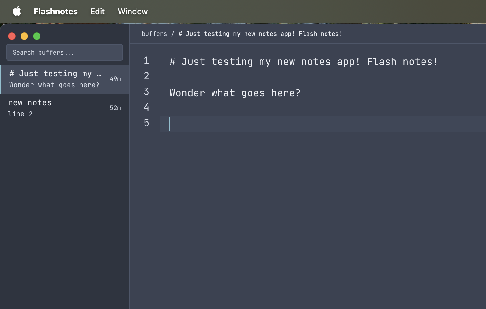

<p align="center">
  
</p>

<h1 align="center">Flashnotes</h1>

<p align="center">
  <strong>A lightweight, free macOS app for capturing notes without saving files.</strong>
</p>

<p align="center">
  
</p>

## Why Flashnotes?

Ever need to jot something down quickly without the hassle of naming files, choosing folders, or clicking save? Flashnotes is your always-ready scratchpad. Just write—everything persists automatically.

## Features

- **Zero friction** — No files, no folders, no save buttons. Just open and type.
- **Instant search** — Find any note in milliseconds with full-text search
- **Markdown preview** — Toggle rendered markdown with `Cmd+E` (supports tables, GFM)
- **Vim mode** — Optional vim keybindings for power users (toggle in Settings)
- **Stay on top** — Pin the window above all others with `Cmd+Shift+T`
- **Quick copy** — Copy entire note to clipboard with `Cmd+Shift+C`
- **Collapsible sidebar** — Toggle with `Cmd+B` for distraction-free writing
- **Command palette** — `Cmd+P` for quick note switching
- **Drag & drop reorder** — Organize notes by dragging, or use `Cmd+Shift+↑/↓`
- **Pin important notes** — Right-click to pin notes to the top
- **Resizable sidebar** — Drag the edge to adjust width (persisted)
- **Customizable fonts** — Choose your preferred monospace font and size
- **Single instance** — Only one window, always ready
- **Dark theme** — Easy on the eyes, inspired by modern editors

## Keyboard Shortcuts

| Shortcut | Action |
|----------|--------|
| `Cmd+P` | Open command palette |
| `Cmd+N` | Create new note |
| `Cmd+W` | Delete current note |
| `Cmd+B` | Toggle sidebar |
| `Cmd+E` | Toggle markdown preview |
| `Cmd+Shift+T` | Toggle stay on top |
| `Cmd+Shift+C` | Copy note to clipboard |
| `Cmd+Shift+↑/↓` | Move note up/down |
| `Cmd+,` | Open settings |
| `Escape` | Clear search |

## Installation

Download the latest `.dmg` from [Releases](https://github.com/garyblankenship/flashnotes/releases), or build from source:

```bash
# Clone the repo
git clone https://github.com/garyblankenship/flashnotes.git
cd flashnotes

# Install dependencies
npm install

# Build for production
npm run tauri build

# Find your app in src-tauri/target/release/bundle/
```

## Development

```bash
# Install dependencies
npm install

# Run in development mode
npm run tauri dev

# Type check
npm run check

# Build for production
npm run tauri build
```

## Tech Stack

- **Frontend:** SvelteKit + Svelte 5 runes + Tailwind CSS
- **Editor:** CodeMirror 6 with GFM markdown support
- **Backend:** Rust + Tauri v2
- **Storage:** SQLite with FTS5 full-text search
- **Fonts:** System monospace fonts (configurable)

## Requirements

- macOS 10.15 (Catalina) or later
- Apple Silicon or Intel Mac

## License

MIT

---

<p align="center">
  Made with ☕ for people who think faster than they can organize.
</p>
